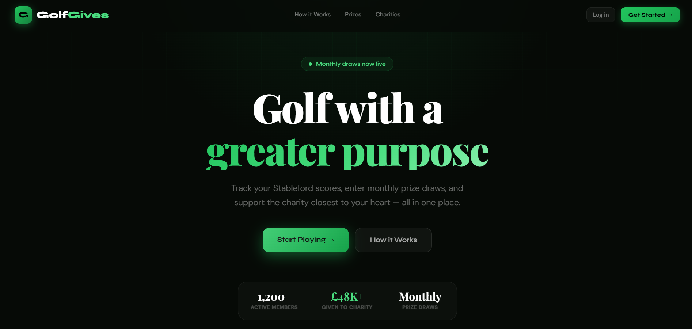
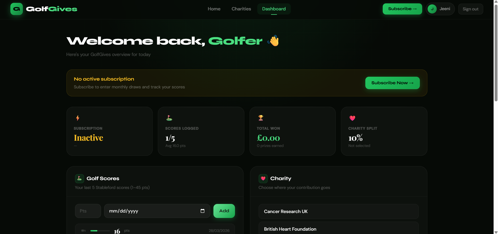
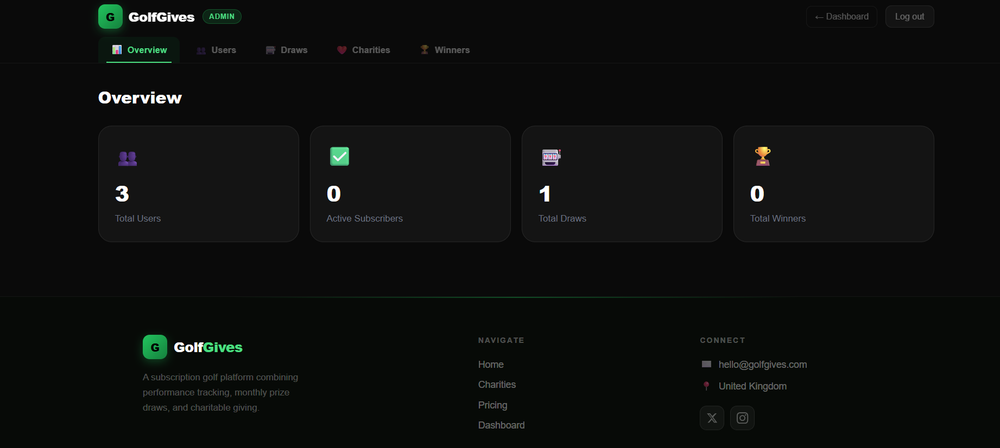

# ⛳ GolfGives — Play. Win. Give.

> A subscription-based golf platform combining performance tracking, monthly prize draws, and charitable giving.



---

## 🌐 Live Demo

🔗 **[golf-charity-platform-rosy.vercel.app](https://golf-charity-platform-rosy.vercel.app)**

| Role | URL | Credentials |
|------|-----|-------------|
| Public | `/` | No login required |
| User | `/dashboard` | Sign up at `/signup` |
| Admin | `/admin` | Contact for admin credentials |

---

## 📸 Dashboards

### User Dashboard


### Admin Panel


---

## 🧠 Project Overview

The platform allows golfers to:
- Subscribe monthly or yearly
- Track their last 5 Stableford scores (rolling window)
- Enter automatic monthly prize draws
- Support a charity of their choice with a portion of their subscription
- Win from a tiered prize pool (5, 4, or 3 number matches)

Admins can:
- Manage users and subscriptions
- Create, simulate, and publish draws
- Manage charity listings
- Verify winners and track payouts

---

## 🗂️ Folder Structure
```
golf-charity-platform/
├── app/
│   ├── admin/
│   │   └── page.js               # Admin dashboard (protected)
│   ├── api/
│   │   ├── admin/
│   │   │   └── draw/
│   │   │       └── route.js      # Draw engine API
│   │   └── stripe/
│   │       ├── checkout/
│   │       │   └── route.js      # Stripe checkout session
│   │       └── webhook/
│   │           └── route.js      # Stripe webhook handler
│   ├── charities/
│   │   └── page.js               # Public charity directory
│   ├── dashboard/
│   │   └── page.js               # User dashboard (protected)
│   ├── login/
│   │   └── page.js               # Login page
│   ├── signup/
│   │   └── page.js               # Signup page
│   ├── subscribe/
│   │   └── page.js               # Subscription/pricing page
│   ├── globals.css               # Global styles
│   ├── layout.js                 # Root layout
│   └── page.js                   # Homepage
├── components/
│   ├── AdminNavbar.js            # Admin panel navbar with tabs
│   ├── AuthNavbar.js             # Authenticated user navbar
│   ├── Footer.js                 # Shared footer
│   └── Navbar.js                 # Public navbar
├── lib/
│   ├── drawEngine.js             # Draw logic (random + weighted)
│   └── supabase.js               # Supabase client
├── public/                       # Static assets & screenshots
├── .env.local                    # Environment variables (not committed)
├── next.config.mjs
├── tailwind.config.js
└── package.json
```

---

## ⚙️ Tech Stack

| Layer | Technology |
|-------|-----------|
| Framework | Next.js 14 (App Router) |
| Styling | Tailwind CSS + Custom CSS |
| Database | Supabase (PostgreSQL) |
| Auth | Supabase Auth |
| Payments | Stripe |
| Deployment | Vercel |

---

## 🗄️ Database Schema

| Table | Purpose |
|-------|---------|
| `profiles` | User profiles, subscription status, charity selection |
| `scores` | Golf scores (max 5 per user, rolling) |
| `charities` | Charity listings |
| `draws` | Monthly draw records |
| `draw_entries` | User entries per draw with match count |
| `winners` | Winners with prize amount and payment status |
| `subscription_logs` | Subscription payment history |

---

## 🎰 Draw & Prize Logic
```
Monthly Prize Pool = 50% of total subscription revenue

┌─────────────────┬────────┬──────────────┐
│ Match Type      │ Share  │ Rollover?    │
├─────────────────┼────────┼──────────────┤
│ 5-Number Match  │  40%   │ ✅ Yes       │
│ 4-Number Match  │  35%   │ ❌ No        │
│ 3-Number Match  │  25%   │ ❌ No        │
└─────────────────┴────────┴──────────────┘

Draw Types:
- Random     — standard lottery-style generation
- Weighted   — based on most frequent user scores
```

---

## 🌟 Key Features

### 👤 User
- ✅ Signup / Login with Supabase Auth
- ✅ Monthly & Yearly subscription via Stripe
- ✅ Rolling 5-score entry system (Stableford, 1–45)
- ✅ Charity selection + adjustable contribution %
- ✅ View published draw results
- ✅ Track winnings and payment status

### 🛠️ Admin
- ✅ User management + subscription toggle
- ✅ Draw creation, simulation & publishing
- ✅ Charity add / delete management
- ✅ Winner verification (Approve / Reject)
- ✅ Mark payouts as completed
- ✅ Overview stats dashboard

### 🎨 Design
- ✅ Emotion-driven, modern dark UI
- ✅ Deliberately avoids traditional golf aesthetics
- ✅ Fully responsive (mobile + desktop)
- ✅ Smooth animations and micro-interactions
- ✅ Auth-aware navbar (swaps based on login state)

---

## 🚀 Getting Started Locally

### Prerequisites
- Node.js 18+
- npm
- Supabase account
- Stripe account

### Installation
```bash
# Clone the repository
git clone https://github.com/YOUR_USERNAME/golf-charity-platform.git

# Navigate into the project
cd golf-charity-platform

# Install dependencies
npm install

# Create environment file
cp .env.local.example .env.local
```

### Environment Variables

Create a `.env.local` file in the root with the following:
```env
NEXT_PUBLIC_SUPABASE_URL=your_supabase_url
NEXT_PUBLIC_SUPABASE_ANON_KEY=your_supabase_anon_key
SUPABASE_SERVICE_ROLE_KEY=your_service_role_key
NEXT_PUBLIC_STRIPE_PUBLISHABLE_KEY=your_stripe_publishable_key
STRIPE_SECRET_KEY=your_stripe_secret_key
NEXT_PUBLIC_STRIPE_MONTHLY_PRICE_ID=your_monthly_price_id
NEXT_PUBLIC_STRIPE_YEARLY_PRICE_ID=your_yearly_price_id
STRIPE_WEBHOOK_SECRET=your_webhook_secret
NEXT_PUBLIC_APP_URL=http://localhost:3000
```

### Run Locally
```bash
npm run dev
```

Visit `http://localhost:3000`

---

## 💳 Stripe Test Cards

| Card Number | Scenario |
|------------|----------|
| `4242 4242 4242 4242` | Successful payment |
| `4000 0000 0000 0002` | Card declined |

Use any future expiry date and any 3-digit CVC.

---

## 📦 Deployment

Deployed on **Vercel** with the following setup:
- Connected to GitHub repository
- All environment variables configured in Vercel dashboard
- Supabase URL configuration updated for production
- Stripe webhook pointed to production URL

---

## 📋 PRD Checklist

- ✅ User signup & login
- ✅ Subscription flow (monthly and yearly)
- ✅ Score entry — 5-score rolling logic
- ✅ Draw system logic and simulation
- ✅ Charity selection and contribution calculation
- ✅ Winner verification flow and payout tracking
- ✅ User Dashboard — all modules functional
- ✅ Admin Panel — full control and usability
- ✅ Data accuracy across all modules
- ✅ Responsive design on mobile and desktop
- ✅ Error handling and edge cases

---

## 👩‍💻 Built By ❤️

**Tanya Vaish**

---

>  If you found this project useful, please give it a ⭐ on GitHub—your support helps me keep improving it!
